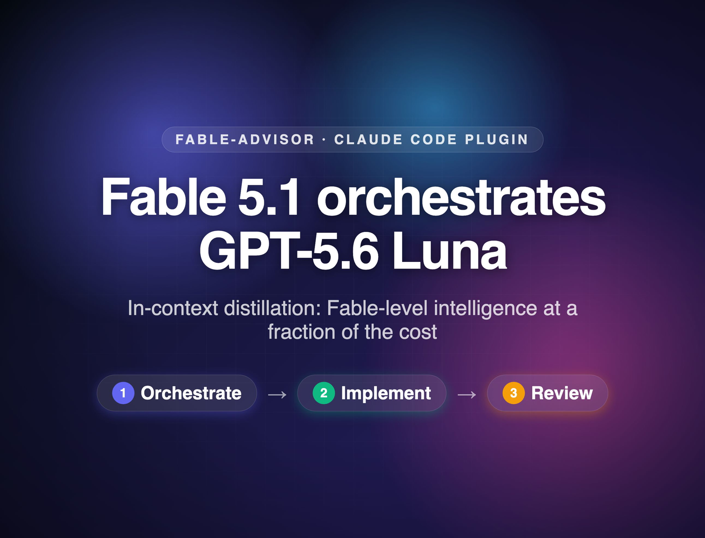

# Fable Advisor

**Fable 5.1 runs the show. Grok, Luna, and Sol do the typing at the effort each task deserves, and nothing ships without a review.**

<a href="https://github.com/NorthAtlanticTech/fable-advisor/raw/main/assets/fable-advisor-demo.mp4"></a>

<p align="center"><em>▶ 30s demo — Fable 5.1 orchestrates → a cross-vendor lane implements → Fable 5.1 reviews</em></p>

Claude Code lets every subagent run on a different model — and lets the session itself run on a different model than its subagents. This plugin exploits that with the **architect pattern**: your session runs on **Fable 5.1**, acting as a full-time architect. It owns requirements, decomposition, specs, and verification — routes every implementation task to the right lane at the right reasoning effort — and gets a clean-context review of the finished work before calling anything done:

| Lane | Producer | Invocation | Route here when |
|---|---|---|---|
| Routine A | **Grok 4.6** | `grok-implementer` agent | The spec fully determines the outcome — Grok does the typing via the [Cursor CLI](https://cursor.com/cli) |
| Routine B | **GPT-5.6 Luna** | `codex-implementer` agent | The same work, via the [Codex CLI](https://github.com/openai/codex) on the fast service tier |
| High-complexity | **GPT-5.6 Sol** | `sol-implementer` agent | One-off tasks where judgment the spec can't capture decides the outcome: subtle concurrency, hard debugging, security-sensitive paths, wide refactors |
| Computer use | **GPT-6 Astra** (`low`) | `codex-implementer`, model overridden | Browser and desktop automation — a long loop of small cheap decisions, not an escalation |
| Review | **Fable 5.1** | `fable-advisor` agent | Commitment boundaries, and **always once at the end** — the advisor reviews the accumulated changes before the architect reports done |
| Review (cross-vendor) | **GPT-6 Astra** (`high`) | `astra-advisor` agent | The same moments, when the blind spot you're hunting is a *Claude* blind spot |
| Counsel | **Fable 5.1 + Astra**, synthesized by Fable | `fable-counsel` + `astra-advisor` | The decisions expensive enough to be worth three consults |

**Routine A and B are co-equal.** Neither is the default. The architect picks per task on availability, toolchain affinity, failure distribution, and cost — and when no signal decides it, alternates. A co-equal pair that always resolves to the same lane has quietly become a single lane with extra documentation.

**Implementation lanes pin no reasoning effort.** The architect names it per task in the spec (`REASONING: low … max`, and `ultra` on Sol), and the lanes pass it through unchanged — mechanical edits run cheap and fast, the hard escalations run at max or ultra. The two counsel seats are the deliberate exception, pinned `high` by different mechanisms: `fable-counsel` sets `effort: high` in its agent frontmatter, while `astra-advisor` pins `model_reasoning_effort=high` on the codex invocation itself, leaving its Claude wrapper cheap. Either way, a consult convened at a commitment boundary gets a deep pass whether or not the session happens to be at high `/effort` that turn.

Tokens route by capability: Fable emits judgment and specs, the cross-vendor lanes emit all of the code, and the premium is spent only where it changes outcomes — the architecture and the final review. Because every implementation lane is a *different model family* than the architect, cross-vendor review is built into the routing, not bolted on.

The plugin ships the **orchestration skill** — the routing doctrine that teaches the session when to use each lane and each effort rung, the cost discipline that keeps Fable token volume minimal (emit judgment not volume, keep context lean, reason once then hand off), the six-part spec contract that makes context-free delegation safe, the verification rules that keep every lane honest, and how to fold in the official [Codex plugin for Claude Code](https://github.com/openai/codex-plugin-cc) when it's installed. It also ships the **cursor-cli skill** — a reference card for driving the Cursor CLI headlessly, including the failure modes that exit 0 while doing nothing.

## Install

```
claude plugin marketplace add NorthAtlanticTech/fable-advisor
claude plugin install fable-advisor@fable-advisor
```

Updating an existing installation to the latest release:

```
claude plugin marketplace update fable-advisor
claude plugin update fable-advisor@fable-advisor
```

Then start your session as the architect:

```
/model fable
```

**Lite mode — one file, 30 seconds.** Don't want the full pattern? Copy [`agents/fable-advisor.md`](agents/fable-advisor.md) into `~/.claude/agents/` and keep your session on Sonnet. You get advisor consults at commitment boundaries without the orchestration layer (see "Advisor-only mode" below).

## Requirements

- **Claude Code ≥ 2.1.170** with a subscription that includes Fable 5.1 (Pro, Max, Team, or Enterprise — all current consumer plans qualify). The agents use the `fable` alias, which resolves to Fable 5.1.
- **No Fable access** (e.g. API-key billing)? Change `model: fable` → `model: opus` in `agents/fable-advisor.md` and `agents/fable-counsel.md`, and run the session on Opus. Same pattern, the Fable role shifts down to Opus.
- **Grok lane:** `grok-implementer` needs the [Cursor CLI](https://cursor.com/cli) installed and authenticated (install from [cursor.com/cli](https://cursor.com/cli), then `agent login`; auth is stored in the macOS Keychain, or set `CURSOR_API_KEY` for headless use). It drives **Grok 4.6 High Fast** headlessly (`agent -p … --model cursor-grok-4.6-high-fast --force --trust`). Grok 4.6 offers `low`/`medium`/`high`/`xhigh` rungs, each with a `-fast` variant, and tier availability varies by plan — the lane verifies the exact slug against `--list-models` before running. One environment note: the Cursor CLI rewrites `~/.cursor/cli-config.json` on startup, so the Bash call wrapping `agent` must run **outside** Claude Code's command sandbox (or `~/.cursor` must be allowlisted for writes) — a blocked write aborts the run *and still exits 0*. The [`cursor-cli` skill](skills/cursor-cli/SKILL.md) documents that and the other zero-exit failure signatures.
- **Codex lanes:** `codex-implementer`, `sol-implementer`, and `astra-advisor` need the [OpenAI Codex CLI](https://github.com/openai/codex) installed and authenticated (`npm i -g @openai/codex`, then `codex login`). They invoke **GPT-5.6 Luna** (`gpt-5.6-luna`, efforts low–max), **GPT-5.6 Sol** (`gpt-5.6-sol`, efforts low–ultra), and **GPT-6 Astra** (`gpt-6-astra`) respectively.
- **Astra needs a recent codex build.** `gpt-6-astra` is newer than some installed CLIs — check `codex --version` if `astra-advisor` reports `unavailable`, and update before assuming an account problem. The agent gates the slug at preflight rather than letting a run silently resolve to another model, which would defeat the cross-vendor independence it exists to provide.
- Every lane reports `STATUS: unavailable` on a missing, unauthenticated, or too-old CLI — it never silently falls back to a Claude model. Without any CLI at all, the pattern degrades to advisor-only mode (below).
- **Optional: the [Codex plugin for Claude Code](https://github.com/openai/codex-plugin-cc)** (`/plugin marketplace add openai/codex-plugin-cc`, then `/plugin install codex@openai-codex`). When it's enabled, the orchestration skill uses `/codex:adversarial-review` as a GPT-family second reviewer ahead of the Fable review, `/codex:rescue` as a user-driven delegation path, and `/codex:setup` to diagnose a lane that reports `unavailable`. Not a dependency — the lanes drive `codex exec` directly either way.
- Heads-up: if a pinned Claude model isn't available on your account, Claude Code silently falls back to your session model — the pattern degrades quietly rather than erroring. If advisor verdicts feel unremarkable, check your plan. (This quiet fallback applies only to Claude model pins — the grok and codex lanes always fail loudly with a structured error.)

Model resolution order in Claude Code: `CLAUDE_CODE_SUBAGENT_MODEL` env var → per-invocation `model` parameter → agent frontmatter → session model. Effort resolution: `CLAUDE_CODE_EFFORT_LEVEL` env var → agent frontmatter `effort` → session `/effort`. `fable-advisor` sets no `effort` and so follows your session; `fable-counsel` pins `high`; the CLI lanes take theirs from the spec, not from frontmatter.

### Cursor API-key authentication

For headless sessions and CI, use Cursor's recommended environment-variable authentication:

1. Create a user API key in the Cursor dashboard under **Integrations → User API Keys**.
2. Supply it to the environment that launches Claude Code as `CURSOR_API_KEY`. The Cursor process is a child of Claude Code and inherits that variable automatically; the plugin never needs the key in its prompt or command line.
3. Confirm that the variable is present without printing it, then launch Claude Code from that same environment:

   ```bash
   test -n "${CURSOR_API_KEY:-}" || { echo "CURSOR_API_KEY is not set"; exit 1; }
   claude
   ```

An `.env` file by itself is not enough unless your shell, launcher, or CI system loads it. In CI, map a secret named `CURSOR_API_KEY` into the step's environment. If you install the CLI or add the variable after Claude Code is already running, restart Claude Code so the new `PATH` and environment are inherited. Never commit the key, paste it into a prompt, echo it in logs, or add it directly to an `agent --api-key …` command where it can leak through shell history or process listings. Interactive local users can instead run `agent login`; the lane checks the inherited environment first and never asks for a login when `CURSOR_API_KEY` is supplied. See Cursor's [CLI authentication guide](https://docs.cursor.com/en/cli/reference/authentication).

## Use it

With the session on Fable, just ask for work — the orchestration skill routes it:

```
Add rate limiting to our public API. Design it, delegate the
implementation, and verify the evidence before you call it done.
```

The architect writes the spec, picks the lane and effort (rate limiting touches concurrency — a good case for `sol-implementer` at `max`, or for racing the two routine lanes and picking the stronger diff), reads the diff and verification evidence when the report comes back, sends the finished work to `fable-advisor` for the final review, and only then reports done.

To make the doctrine always-on, add one line to your project's `CLAUDE.md`:

```
You are the architect — minimize your own token volume. Delegate all
implementation through the orchestration skill's routing table (never
type code yourself), name a reasoning effort per task, delegate broad
codebase exploration to cheap read-only agents, verify evidence before
accepting any lane's report, and get an advisor review before
reporting any deliverable done.
```

## Commitment boundaries and the final review

Even the architect gets a second opinion. The `fable-advisor` agent is a read-only skeptic on the same model as the architect but in a clean context — consulted before architecture decisions, migrations, API designs, whenever a problem has resisted two attempts, and **always once at the end of a deliverable**, where it reads the accumulated diff with fresh eyes, against the stated goal rather than the conversation, and returns ship / fix-first / rethink. It never implements.

That context-clean skepticism is what the ordinary final review buys. What it does not buy is independence: the advisor and the architect are the same model, and a blind spot they share survives the review. `astra-advisor` is the cheap fix — the same consult from **GPT-6 Astra** at high reasoning, outside the Anthropic family entirely. Reach for it whenever the risk you're trying to catch is a Claude blind spot rather than a missing detail.

## Counsel

For the decisions where a wrong answer is genuinely expensive — an irreversible migration, a public API you'll support for years, a security-sensitive design, or a question that has already burned two attempts — convene a **counsel**: two independent seats at high reasoning, then a Fable synthesis over both.

1. **The seats, in parallel:** `fable-counsel` with `MODE: SEAT` (Fable 5.1, effort pinned `high`) and `astra-advisor` (GPT-6 Astra, effort pinned `high`). Both get the same brief. **Neither sees the other's verdict** — two seats that have read each other are one opinion with a co-signature, and the independence is the only thing that makes the third call worth paying for.
2. **The synthesis:** `fable-counsel` with `MODE: SYNTHESIS`, handed both verdicts verbatim. It returns the single recommendation to act on, the fact any disagreement turns on, and — the finding a counsel exists to surface — any **unearned agreement**, where both seats leaned on the same unverified assumption.

Three read-only consults. Don't convene one for routine reviews, ordinary features, anything reversible in an afternoon, or any decision where you already know what you'd do with either answer.

## Advisor-only mode (the original pattern)

The minimal arrangement, for when you'd rather skip the orchestration layer: run the session on Sonnet and consult `fable-advisor` only at commitment boundaries.

```
Migrate our checkout sessions from Postgres to Redis — plan it,
consult your advisor before committing, then implement.
```

A typical consult costs cents. To make it automatic, add to your project's `CLAUDE.md`:

```
Before committing to any architecture decision, migration, or refactor
touching 3+ files, consult the fable-advisor agent and act on its verdict.
```

## FAQ

**Is this Anthropic's "advisor tool"?** No — that's a server-side API feature. These are plain Claude Code subagents plus a skill: readable, editable, no beta flags.

**Does this work on claude.ai?** No — subagent model routing is Claude Code only (CLI, desktop, VS Code, web).

**Why not just let Fable write the code too?** You can. It's excellent. It's also the most expensive model per token, and most of a session's tokens are implementation mechanics that the cross-vendor lanes handle at near-parity — and from a different vendor, which buys you a real second opinion. Spend the premium where it changes outcomes: the architecture and the final review.

**Why non-Claude lanes in a Claude plugin?** Vendor diversity. Models from one family share blind spots; an independent implementation from a different lineage catches what same-family review misses — and with Claude as the architect and reviewer, every diff gets cross-vendor review for free. The architect and reviewer stay Claude; the lanes are producers, not judges. `astra-advisor` is the one deliberate crack in that rule, for the cases where the reviewer's own family is the risk.

**Why keep Grok when upstream dropped it?** Failure distribution. Grok and Luna sit at the same tier and cost, so keeping both is nearly free, and a task that fails in one routine lane on a spec you believe is correct is often landed by the other — a cheap second family beats an expensive same-family retry. This fork's routing treats them as co-equal peers rather than restoring Grok as the default.

**Upgrading from v3.3 (this fork)?** v5 merges upstream's v4 and v5: the architect moves to **Fable 5.1**, `codex-implementer` is re-pointed from Sol to **GPT-5.6 Luna** as a routine lane (keeping this fork's fast service tier), **`sol-implementer`** becomes the high-complexity escalation, and reasoning effort is **unpinned everywhere** — the architect names it per task in a new sixth spec line. The **Grok lane and `cursor-cli` skill are retained** as a co-equal routine lane. New in this fork: **`astra-advisor`**, **`fable-counsel`**, the **counsel** procedure, and the computer-use routing rule (GPT-6 Astra at `low`).

**Upgrading from v4?** v5 moves the session architect from Opus to **Fable 5.1**, replaces the Fable 5 `fable-implementer` lane with **`sol-implementer`** (GPT-5.6 Sol via Codex), and unpins reasoning effort everywhere. The Codex plugin integration is new and optional. If you still want a Claude implementation lane, grab [`fable-implementer.md` from the v4.0 tree](https://github.com/DannyMac180/fable-advisor/blob/ad2bdc3/agents/fable-implementer.md).

**Upgrading from v3?** Upstream's v4 moved the architect to Opus, removed the Grok 4.6 lane, and made `codex-implementer` the default typing lane. This fork kept the Grok lane throughout; if you're coming from upstream and want it back, it's [`agents/grok-implementer.md`](agents/grok-implementer.md) here.

## Releases

Versioning is automated. Every push to `main` runs commitizen ([`.github/workflows/release.yml`](.github/workflows/release.yml)): it reads the [Conventional Commits](https://www.conventionalcommits.org/) since the last `vX.Y.Z` tag, computes the semver bump, mirrors it into [`.claude-plugin/plugin.json`](.claude-plugin/plugin.json), updates `CHANGELOG.md`, tags the release, and publishes a GitHub Release. Nothing is hand-edited.

Commit type → version bump:

| Commit | Example | Bump |
|---|---|---|
| `fix:` | `fix: grok lane no longer swallows timeouts` | patch (`5.0.0 → 5.0.1`) |
| `feat:` | `feat: add a self-hosted implementer lane` | minor (`5.0.0 → 5.1.0`) |
| `feat!:` / `BREAKING CHANGE:` | `feat!: rename the advisor agent` | major (`5.0.0 → 6.0.0`) |
| `docs:`, `chore:`, `ci:`, `refactor:`, `test:`, `style:` | `docs: clarify the spec contract` | none |

A push with only no-bump commits is a clean no-op — no tag, no release. Commit messages are linted on every PR ([`.github/workflows/commit-lint.yml`](.github/workflows/commit-lint.yml)); a non-conforming message fails there rather than silently producing no release. The git tag is the source of truth ([`.cz.toml`](.cz.toml), `version_provider = scm`); `plugin.json` is the mirror. Author commits with `cz commit` (from [commitizen](https://commitizen-tools.github.io/commitizen/)) or write the format by hand.

## Credits

Forked from [DannyMac180/fable-advisor](https://github.com/DannyMac180/fable-advisor), whose v4 and v5 releases contributed the per-task effort model, the `sol-implementer` lane, and the mandatory end-of-deliverable review.

## Go deeper

The upstream author writes [**Attention Heads**](https://attentionheads.substack.com/?utm_source=github&utm_medium=readme&utm_campaign=fable-advisor) — deep, evidence-backed writing on AI, cognition, and agentic engineering. The **Agentic Engineering Field Notes** series is where they publish practical advice on the craft of using AI. [Subscribe](https://attentionheads.substack.com/subscribe?utm_source=github&utm_medium=readme&utm_campaign=fable-advisor) to get new posts to your inbox.

## License

MIT
